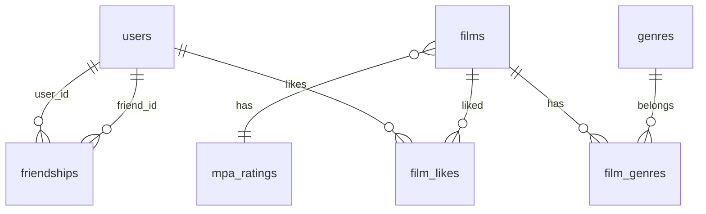

# java-filmorate

Template repository for Filmorate project.

## Схема базы данных

### Пояснение

Схема нормализована до 3НФ:

- users — пользователи Filmorate.
- films — фильмы, у каждого один рейтинг MPA (mpa_rating_id).
- mpa_ratings, genres — справочники.
- film_genres — связь многие-ко-многим между фильмами и жанрами.
- film_likes — лайки пользователей (тоже many-to-many).
- friendships — дружба со статусом UNCONFIRMED / CONFIRMED.

### Работа с базой данных

Проект использует встроенную **H2**:

- Продакшн: `jdbc:h2:file:./db/filmorate` — данные сохраняются в файл.
- Тесты: `jdbc:h2:mem:testdb` — база в памяти, удаляется после тестов.

Схема создаётся автоматически из `src/main/resources/schema.sql` при запуске.
Справочники жанров и рейтингов — в `data.sql`.

### Эндпоинты

- GET /genres, GET /genres/{id}
- GET /mpa, GET /mpa/{id}
- GET /films, POST /films, PUT /films
- PUT /films/{id}/like/{userId}, DELETE /films/{id}/like/{userId}
- GET /films/popular?count=N
- GET /users, POST /users, PUT /users
- PUT /users/{id}/friends/{friendId}, DELETE /users/{id}/friends/{friendId}
- GET /users/{id}/friends, GET /users/{id}/friends/common/{otherId}

### Запуск

    mvn spring-boot:run

### Тесты

    mvn test
