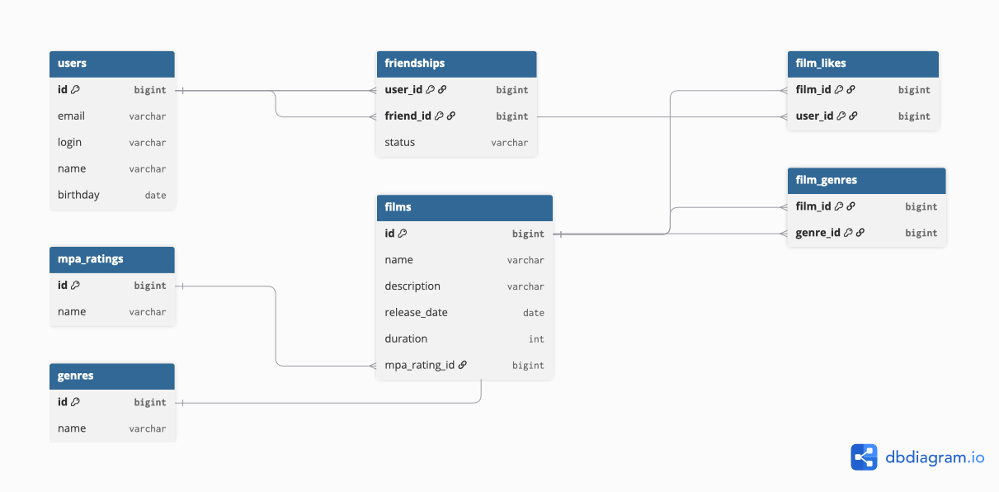

# java-filmorate

Template repository for Filmorate project.

## Схема базы данных

### Пояснение

Схема нормализована до 3НФ:

- `users` — пользователи Filmorate.
- `films` — фильмы, у каждого один рейтинг MPA (`mpa_rating_id`).
- `mpa_ratings`, `genres` — справочники.
- `film_genres` — связь «многие-ко-многим» между фильмами и жанрами.
- `film_likes` — лайки пользователей (тоже many-to-many).
- `friendships` — дружба со статусом `UNCONFIRMED` / `CONFIRMED`.

### Примеры запросов

Все фильмы:

    SELECT * FROM films;

Все пользователи:

    SELECT * FROM users;

Топ-10 популярных фильмов:

    SELECT f.id, f.name, COUNT(fl.user_id) AS likes
    FROM films f
    LEFT JOIN film_likes fl ON f.id = fl.film_id
    GROUP BY f.id, f.name
    ORDER BY likes DESC
    LIMIT 10;

Общие друзья двух пользователей:

    SELECT u.*
    FROM users u
    JOIN friendships f1 ON u.id = f1.friend_id
        AND f1.user_id = ? AND f1.status = 'CONFIRMED'
    JOIN friendships f2 ON u.id = f2.friend_id
        AND f2.user_id = ? AND f2.status = 'CONFIRMED';

Фильмы по жанру:

    SELECT f.*
    FROM films f
    JOIN film_genres fg ON f.id = fg.film_id
    JOIN genres g ON fg.genre_id = g.id
    WHERE g.name = 'Комедия';
